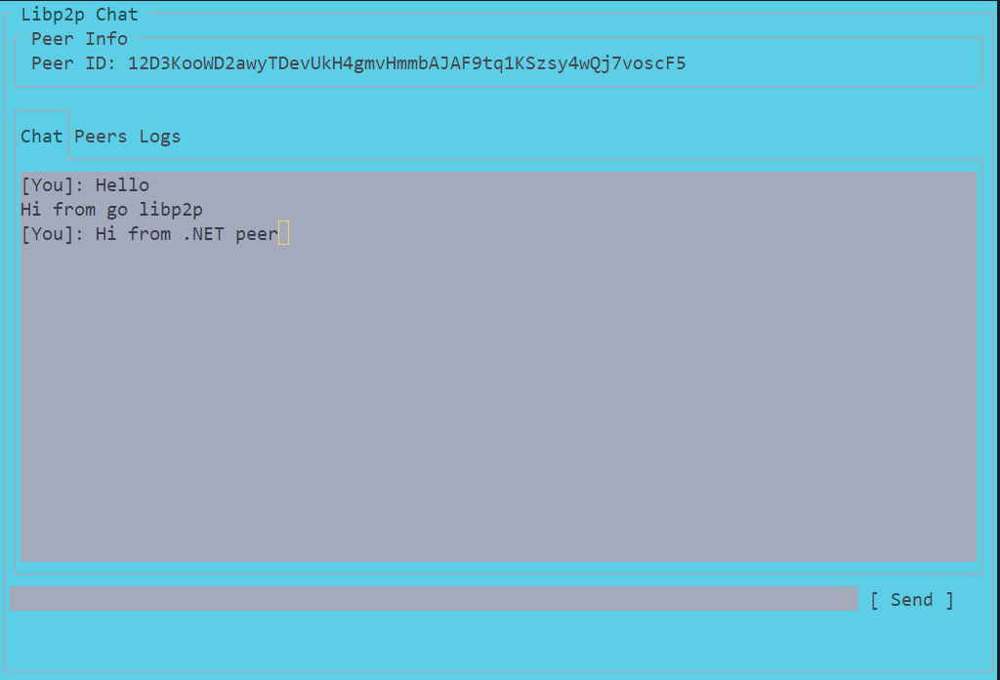

# .NET libp2p Chat Application


<p align="center">
  
  <br/>
  <em>The .NET libp2p chat application Console UI</em>
</p>

A simple chat application built on top of [dotnet-libp2p](https://github.com/NethermindEth/dotnet-libp2p). This project demonstrates a robust, console-based UI (using [Terminal.Gui](https://github.com/migueldeicaza/gui.cs)) to showcase basic peer-to-peer communication using Libp2p protocols. **Note:** This project is in beta and under active development.

## Overview

dotnet-libp2p Chat aims to provide a performant, well-tested implementation of a wide range of protocols that works on multiple platforms, with high throughput and a low memory profile. This chat application leverages Libp2p's PubSub to exchange messages between peers while also displaying vital information such as your peer ID and multiaddress so that you can easily share your connection details with others.

### Key Features
- **Console UI:** A robust, multi-tab interface built with Terminal.Gui.
- **Peer Information:** Displays generated peer ID and multiaddress for connecting with others.
- **Messaging:** Supports JSON-formatted messages as well as plain text messages.
- **Protocol Integration:** Uses multiple Libp2p protocols for transport and discovery.
- **Thread-Safe Updates:** UI updates are marshaled on the main loop ensuring smooth and safe interactions.
## Requirements

- [.NET 8.0 SDK](https://dotnet.microsoft.com/download/dotnet/8.0) or newer
- Windows, macOS, or Linux operating system

## Installation

Clone the repository and navigate to the dotnet-peer directory:

```bash
git clone https://github.com/leny62/universal-connectivity
cd universal-connectivity/dotnet-peer/Libp2pChat
```

Build the application:

```bash
dotnet build
```

## Usage

Run the application with the default Console UI:

```bash
dotnet run
```

For debug logging:

```bash
dotnet run -- --trace
```

### UI

#### 1. Terminal.Gui-based UI

An alternate UI implementation using the Terminal.Gui library (a cross-platform console UI toolkit):
- Offers a more traditional GUI-like experience
- Provides tab-based navigation
- Includes a formal message input field with send button
- Handles window resize events

### User Interface

The application features a TUI (Terminal User Interface) with three main panels:

1. **Chat Room**: The main panel where messages appear
2. **Peers List**: Shows connected peers with their shortened Peer IDs
3. **System Logs**: Displays all system events, connection details, and errors

### Commands

- Type a message and press Enter to send it to all connected peers
- Type `exit` to close the application
- Use arrow keys to navigate text input
- Resize the terminal window to see the responsive layout adjust

## Connecting with Other Peers

By default, the application listens on TCP port 9096. This setup enables direct connections with peers that support TCP-based transports, such as Go or Rust implementations. However, due to current transport limitations in dotnet-libp2p, connecting with browser-based JavaScript peers is not yet supported.

### How to Connect:
1. **Note Your Peer ID:**  
   Your Peer ID is displayed in the **System logs** panel upon startup.
2. **Connect from Other Environments:**  
   - **Go/Rust Peers:** Update the hardcoded Peer ID in their configuration (e.g., in `main.go` for the Go peer) with your .NET peer's ID.
   - **JavaScript Peers:**  
     - **Node.js Environment:** JavaScript peers running in Node.js can connect using TCP.  
     - **Browser Environments:** Direct connection is currently not possible because the required browser-friendly transports (e.g., WebSockets or WebRTC) are not implemented.
     
### Way Forward:
- **Transport Enhancements:**  
  Future work is focused on implementing additional transport protocols (such as WebSockets and WebRTC) to enable connectivity with browser-based peers.
- **Community Contributions:**  
  Contributions to extend transport support are highly welcome.
- **Stay Updated:**  
  Follow the progress in [libp2p/universal-connectivity](https://github.com/libp2p/universal-connectivity) and our project roadmap for the latest updates on transport and protocol support.


## Architecture

The application is built using:

- **Nethermind.Libp2p**: The core libp2p implementation for .NET
- **Terminal.Gui**: TUI framework for .NET (optional implementation)
- **Spectre.Console**: Rich console output for colorful text and UI elements
- **Microsoft.Extensions.DependencyInjection**: For dependency injection and service configuration
- **System.Text.Json**: For message serialization/deserialization

### Key Components

- **ChatMessage**: Defines the shared message format used for communication between peers, ensuring compatibility with other implementations.
- **Program.cs**: Contains the entire application logic, including:
  - **UI Management:** Implements the terminal interface using Terminal.Gui (handling chat, peers, and logs).
  - **Libp2p Configuration:** Sets up peer identity, transport (TCP by default), and PubSub messaging.
  - **Message Handling:** Manages serialization/deserialization of messages and processes both JSON and plain text messages.


### Project Structure

```
dotnet-peer/
├── Libp2pChat/
│   ├── Program.cs         # Main application entry point
│   └── Libp2pChat.csproj  # Project file with dependencies
└── README.md              # This documentation
```

## Integration with Other libp2p Implementations

This .NET peer is part of a larger universal connectivity demo that includes implementations in:

- Go (`/go-peer`)
- Rust (`/rust-peer`) 
- JavaScript (`/js-peer`)

All implementations use compatible message formats and the GossipSub protocol for decentralized chat.

## Troubleshooting

### Connection Issues

- Ensure firewalls allow TCP connections on port 9096
- Verify the Peer ID is correctly shared between applications
- Check System logs panel for detailed error messages

### UI Display Issues

- Resize the terminal window if panels appear distorted
- Ensure your terminal supports UTF-8 for proper display of box characters
- For Windows users, consider using Windows Terminal for best results

## Contributing

Contributions are welcome! Here are some ways you can contribute:

1. Report bugs and issues
2. Add new features or enhancements
3. Improve documentation
4. Submit pull requests

Please follow the existing code style and include appropriate tests.

## License

This project is licensed under dual MIT/Apache-2.0 license - see the [LICENSE-MIT](../../LICENSE-MIT) and [LICENSE-APACHE](../../LICENSE-APACHE) files for details.
