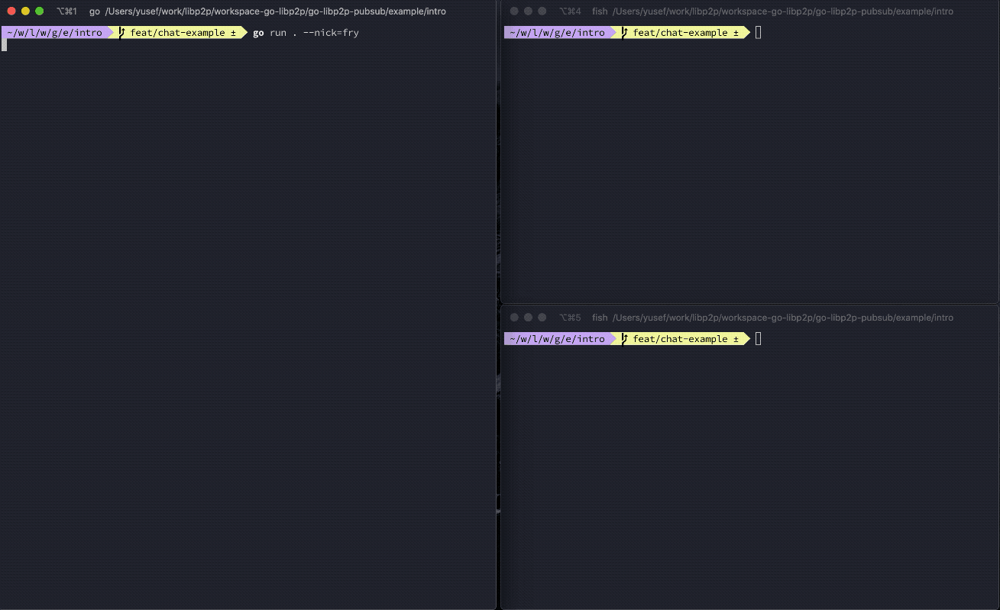

# go-libp2p-pubsub chat example

This example project builds a chat room application using go-libp2p. The app runs in the terminal,
and uses a text UI to show messages from other peers:



## Running

Clone this repo, then `cd` into the `go-peer` directory:

```shell
git clone https://github.com/libp2p/universal-connectivity
cd universal-connectivity/go-peer
```

Now you can either run with `go run`, or build and run the binary:

```shell
go run .

# or, build and run separately
go build .
./go-peer
```

To set a nickname, use the `-nick` flag:

```shell
go run . -nick=zoidberg
```

You can join a specific chat room with the `-room` flag:

```shell
go run . -room=planet-express
```

It's usually more fun to chat with others, so open a new terminal and run the app again.
If you set a custom chat room name with the `-room` flag, make sure you use the same one
for both apps. Once the new instance starts, the two chat apps should discover each other 
automatically using mDNS, and typing a message into one app will send it to any others that are open.

To quit, hit `Ctrl-C`, or type `/quit` into the input field.
