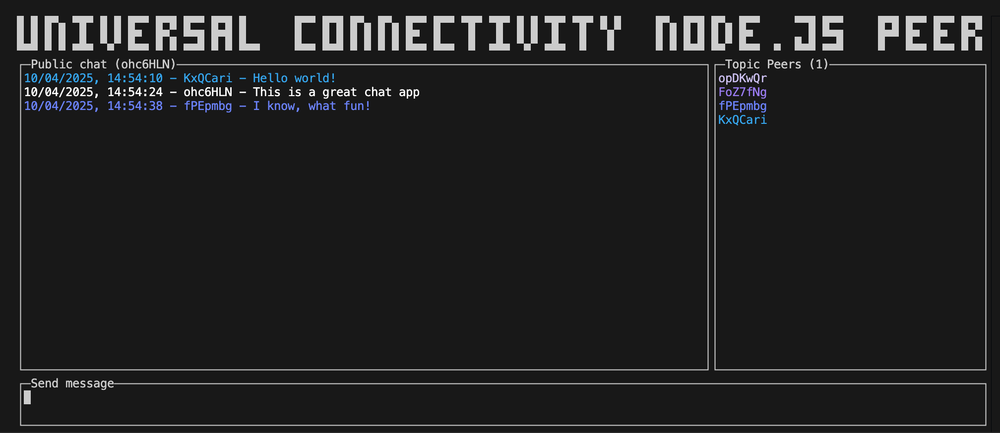

# Node.js peer

This is a JavaScript peer for the Universal Connectivity app implemented as a
command line app using a Terminal User Interface aimed at Node.js.

The TUI is implemented using [react-curse](https://www.npmjs.com/package/react-curse),
a JavaScript so should be familiar to anyone who has used [React](https://react.dev/) before.

## Getting Started

To start the app run:

```bash
npm start
# or
yarn start
# or
pnpm start
```

You should see a terminal user interface similar to this:



Use `CTRL-C` to exit the app.

## Hacking

You can start editing the app by modifying [./App.tsx](./App.tsx) and restarting the app.

The libp2p configuration can be found in [./lib/libp2p.ts](./lib/libp2p.ts).

## Learn More

To learn more about libp2p, take a look at the following resources:

- [js-libp2p on GitHub](https://github.com/libp2p/js-libp2p) - The js-libp2p repo
- [API docs](https://libp2p.github.io/js-libp2p/) - API documentation
- [Docs](https://github.com/libp2p/js-libp2p/tree/main/doc) - Longer form docs
- [Examples](https://github.com/libp2p/js-libp2p-examples) - How to do almost anything with your libp2p node
