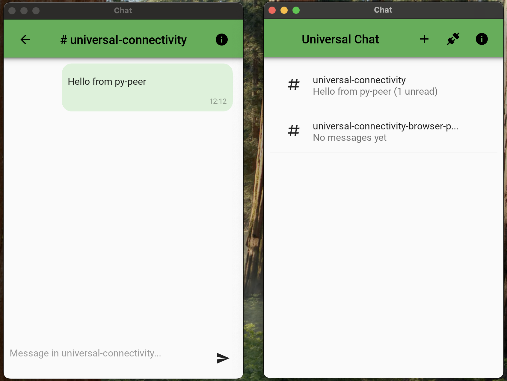
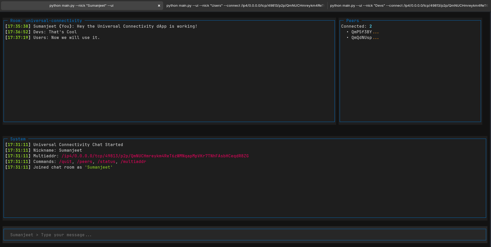

# py-peer 🌐

A Python implementation of the Universal Connectivity peer-to-peer chat application using libp2p networking with multiple UI options including a modern mobile-friendly interface.

This is the Python implementation of the [Universal Connectivity][UNIV_CONN] app showcasing the [Gossipsub][GOSSIPSUB] features of the core libp2p protocol as found in the [py-libp2p][PYLIBP2P] Python libp2p implementation. The implementation currently uses TCP.

## 📋 Table of Contents

- [Overview](#overview)
- [Features](#features)
- [Screenshots](#screenshots)
- [Architecture](#architecture)
- [Prerequisites](#prerequisites)
- [Installation](#installation)
- [Usage](#usage)
- [User Interfaces](#user-interfaces)
- [Configuration](#configuration)
- [Development](#development)
- [Troubleshooting](#troubleshooting)
- [Contributing](#contributing)

## 🚀 Overview

py-peer is a decentralized chat application that enables peer-to-peer communication without requiring central servers. Built on libp2p, it provides secure, direct communication between participants using modern networking protocols. It offers three distinct UI modes to suit different use cases: a mobile-friendly Kivy interface, a terminal-based Textual TUI, and a simple CLI mode.

## 📸 Screenshots

### Kivy Mobile-Friendly Interface (NEW!)


*The modern Kivy/KivyMD interface featuring WhatsApp-style navigation, topic-based conversations, and one-tap copy functionality for peer IDs and multiaddresses.*

### Textual TUI Interface


*The Textual Terminal User Interface showing a live chat session with multiple connected peers. The interface features a main chat area, connected peers panel, system messages, and input field.*

## 🎯 Key Technologies

- **[libp2p](https://libp2p.io/)** - Modular peer-to-peer networking stack
- **[Trio](https://trio.readthedocs.io/)** - Async/await framework for Python
- **[KivyMD](https://kivymd.readthedocs.io/)** - Material Design mobile UI framework
- **[Textual](https://textual.textualize.io/)** - Modern Terminal User Interface framework
- **[GossipSub](https://docs.libp2p.io/concepts/pubsub/overview/)** - Pub/sub messaging protocol

## ✨ Features

### Core Features
- **Peer-to-Peer Chat** - Direct communication without central servers
- **Multiple UI Modes** - Kivy mobile UI, Textual TUI, or simple CLI mode
- **Real-time Messaging** - Instant message delivery through GossipSub
- **Peer Discovery** - Automatic discovery of other peers in the network
- **Cross-Platform** - Works on Linux, macOS, Windows, and mobile platforms
- **Secure Communication** - Built-in encryption and peer authentication

### Advanced Features (NEW!)
- **Topic-Based Conversations** - Subscribe to and chat in multiple topics simultaneously
- **WhatsApp-Style Interface** - Intuitive topic selector with unread message counts
- **Dynamic Topic Management** - Add new topics on the fly without restarting
- **Per-Topic Message Storage** - Messages organized by topic with read/unread tracking
- **Dynamic Peer Connection** - Connect to peers using their multiaddress through the UI
- **One-Tap Copy** - Easy sharing of Peer ID and Multiaddr with clickable copy
- **Message Filtering** - View messages only for the selected topic
- **Custom Topics** - Use custom topic names via command line or UI
- **Persistent Connections** - Automatic peer connection maintenance

### UI-Specific Features

#### Kivy UI Features
- Topic list with unread counts
- Per-topic conversation views
- Tap-to-copy for Peer ID and Multiaddr
- Dynamic peer connection dialog
- Connection info display
- Material Design aesthetic

#### Textual TUI Features
- Live peer count display
- System message logging
- Interactive command support
- Real-time chat updates

#### CLI Features
- Simple text-based interface
- Command history
- Minimal resource usage

## 🏗️ Architecture

```
┌─────────────────────────────────────────────────────────────┐
│                     UI Layer (Choose One)                   │
├─────────────────┬─────────────────┬─────────────────────────┤
│   Kivy UI       │  Textual TUI    │   CLI Mode              │
│                 │                 │                          │
│ • Topics List   │ • Chat Window   │ • Simple Input/Output   │
│ • Chat Screens  │ • Peers Panel   │ • Commands              │
│ • Copy Features │ • System Log    │ • Direct Messaging      │
│ • Peer Connect  │ • Commands      │                         │
└────────┬────────┴────────┬────────┴────────┬────────────────┘
         │                 │                 │
         └─────────────────┼─────────────────┘
                           │
                  ┌────────▼────────┐
                  │ Headless Service │
                  │                  │
                  │ • Message Queue  │
                  │ • Topic Storage  │
                  │ • Event Loop     │
                  │ • State Mgmt     │
                  └────────┬─────────┘
                           │
                  ┌────────▼─────────┐
                  │   Chat Room      │
                  │                  │
                  │ • libp2p Host    │
                  │ • PubSub/GossipSub│
                  │ • DHT            │
                  │ • Topic Handlers │
                  └────────┬─────────┘
                           │
                  ┌────────▼─────────┐
                  │   P2P Network    │
                  │                  │
                  │ • Peer Discovery │
                  │ • Message Relay  │
                  │ • Topic Routing  │
                  └──────────────────┘
```

### Components

- **main.py** - Application entry point and argument parsing
- **kivy_ui.py** - Modern mobile-friendly Kivy interface (NEW!)
- **ui.py** - Textual-based terminal user interface
- **headless.py** - Background service managing libp2p operations
- **chatroom.py** - Chat room logic, topic management, and message handling

### Message Flow

```
User Input → UI Thread → Queue → Async Thread (Trio)
                                      ↓
                              HeadlessService
                                      ↓
                                  ChatRoom
                                      ↓
                              GossipSub/PubSub
                                      ↓
                                  P2P Network
                                      ↓
                              Other Peers
```

## 📋 Prerequisites

- **Python 3.12+**
- **uv** (recommended) or pip package manager
- Network connectivity for peer-to-peer communication
- For Kivy UI: Additional system dependencies (see Installation)

## 🛠️ Installation

### Option 1: Using uv (Recommended)

```bash
# Clone the repository
git clone https://github.com/sumanjeet0012/universal-connectivity.git
cd universal-connectivity

# Switch to the py-peer development branch
git checkout py-peer-development
cd py-peer

# Create virtual environment
uv venv

# Activate virtual environment
source .venv/bin/activate  # Linux/macOS
# or
.venv\Scripts\activate     # Windows

# Install the package
uv pip install -e .
```

### Option 2: Using pip

```bash
# Clone the repository
git clone https://github.com/sumanjeet0012/universal-connectivity.git
cd universal-connectivity

# Switch to the py-peer development branch
git checkout py-peer-development
cd py-peer

# Create virtual environment
python -m venv .venv

# Activate virtual environment
source .venv/bin/activate  # Linux/macOS
# or
.venv\Scripts\activate     # Windows

# Install the package
pip install -e .
```

### Kivy UI Dependencies

For the Kivy mobile interface, you may need additional system dependencies:

**Linux (Ubuntu/Debian):**
```bash
sudo apt-get install -y \
    python3-dev \
    build-essential \
    git \
    ffmpeg \
    libsdl2-dev \
    libsdl2-image-dev \
    libsdl2-mixer-dev \
    libsdl2-ttf-dev \
    libportmidi-dev \
    libswscale-dev \
    libavformat-dev \
    libavcodec-dev \
    zlib1g-dev
```

**macOS:**
```bash
brew install sdl2 sdl2_image sdl2_ttf sdl2_mixer
```

## 🎯 Usage

### Quick Start

```bash
# Kivy UI (Mobile-friendly interface)
python main.py --kivy --nick Alice

# Textual TUI (Terminal interface)
python main.py --ui --nick Bob

# Simple CLI mode
python main.py --nick Charlie

# Headless mode (no UI)
python main.py --headless --nick Dave
```

### Command Line Options

| Option | Description | Example |
|--------|-------------|---------|
| `--nick NAME` | Set your nickname (required) | `--nick Alice` |
| `--kivy` | Use Kivy mobile-friendly UI | `--kivy` |
| `--ui` | Use Textual TUI interface | `--ui` |
| `--headless` | Run without UI (logs only) | `--headless` |
| `-c, --connect ADDR` | Connect to specific peer | `-c /ip4/...` |
| `-p, --port PORT` | Set listening port | `-p 8080` |
| `-t, --topic TOPIC` | Set custom default topic | `-t my-topic` |
| `-s, --seed SEED` | Seed for deterministic peer ID | `-s 12345` |
| `-v, --verbose` | Enable debug logging | `-v` |
| `--no-strict-signing` | Allow unsigned messages | `--no-strict-signing` |

### Connecting Peers

**Peer 1:**
```bash
python main.py --kivy --nick Alice --port 9095
# Get your multiaddr from the info dialog (tap ℹ️ icon)
```

**Peer 2:**
```bash
# Use the multiaddr from Peer 1
python main.py --kivy --nick Bob --connect /ip4/192.168.1.100/tcp/9095/p2p/QmXXX...
```

## 🖥️ User Interfaces

### 1. Kivy UI (Recommended for Mobile/Desktop)

**Features:**
- WhatsApp-style topic selector
- Per-topic conversations
- Unread message counts
- Tap-to-copy for sharing
- Dynamic peer connection
- Material Design

**Navigation:**
```
Topics Screen (Main)
  ├─ Tap topic → Open conversation
  ├─ + button → Subscribe to new topic
  ├─ 🔗 button → Connect to peer
  └─ ℹ️ button → View connection info

Chat Screen
  ├─ Back → Return to topics
  ├─ ℹ️ button → Show status
  └─ Type & send messages
```

**Copying Peer Info:**
1. Tap ℹ️ (info) icon
2. Tap on Peer ID or Multiaddr card
3. Value copied to clipboard automatically

### 2. Textual TUI

**Features:**
- Terminal-based interface
- Live peer count
- System messages panel
- Command support

**Commands:**
- `/quit` - Exit the chat
- `/peers` - Show connected peers
- `/status` - Display connection status
- `/multiaddr` - Show your multiaddress

**Note:** Copy multiaddr from `system_messages.txt` file for sharing.

### 3. Simple CLI Mode

**Features:**
- Minimal interface
- Direct input/output
- Command history
- Low resource usage

**Usage:**
Just type messages and press Enter. Use `/quit` to exit.

## ⚙️ Configuration

### Custom Topics

**Via Command Line:**
```bash
python main.py --kivy --nick Alice --topic my-custom-topic
```

**Via UI (Kivy):**
1. Tap + button in Topics screen
2. Enter topic name
3. Tap SUBSCRIBE

### Dynamic Peer Connection (Kivy UI)

1. Get peer's multiaddr:
   - Tap ℹ️ icon in Topics screen
   - Tap on Multiaddr card to copy
   
2. Connect to peer:
   - Tap 🔗 icon in Topics screen
   - Paste multiaddr
   - Tap CONNECT

### Message Storage

Messages are stored per-topic with read/unread tracking:
- Unread messages appear in topic list
- Opening a topic marks messages as read
- Messages persist during session only

### Log Files

- **`system_messages.txt`** - System events and connection logs
  - Format: `[HH:MM:SS] message`
  - Contains: startup, peer connections, errors, multiaddr

## 🔧 Development

### Project Structure

```
py-peer/
├── main.py              # Entry point & argument parsing
├── kivy_ui.py          # Kivy mobile UI (NEW!)
├── ui.py               # Textual TUI implementation
├── headless.py         # Background service & state management
├── chatroom.py         # Chat room logic & topic handling
├── pyproject.toml      # Project configuration & dependencies
├── uv.lock            # Dependency lock file
├── system_messages.txt # System logs
└── README.md          # This file
```

### Key Classes

**kivy_ui.py:**
- `ChatScreen` - Per-topic conversation view
- `TopicsScreen` - Main topic selector (WhatsApp-style)
- `PeersScreen` - Connected peers list
- `ChatApp` - Main Kivy application

**headless.py:**
- `HeadlessService` - Background libp2p service
- Manages queues, message storage, peer connections
- Per-topic message tracking with read/unread status

**chatroom.py:**
- `ChatRoom` - Core libp2p chat functionality
- Dynamic topic subscription
- Unified message handler for all topics
- Message validation & signing

### Running from Source

```bash
# Development mode with debug logging
python main.py --kivy --nick TestUser --verbose

# Test with multiple topics
python main.py --kivy --nick Alice --topic dev-chat

# Run with specific port
python main.py --kivy --nick Bob --port 8080
```

### Code Style

The project follows Python best practices:
- Type hints where applicable
- Async/await patterns with Trio
- Modular architecture
- Thread-safe queue-based communication
- Comprehensive logging
- Material Design UI principles (Kivy)

## 🐛 Troubleshooting

### Common Issues

**1. Port Already in Use**
```bash
# Solution: Specify a different port
python main.py --kivy --nick YourName --port 8081
```

**2. No Peers Found**
- Ensure other peers are running on the same network
- Check firewall settings
- Use `--connect` or UI connect button to manually connect
- Verify multiaddr format is correct

**3. Kivy UI Not Starting**
```bash
# Install system dependencies (Linux)
sudo apt-get install libsdl2-dev

# Reinstall Kivy
pip install --force-reinstall kivy kivymd
```

**4. Messages Not Appearing**
- Check if you're subscribed to the correct topic
- Verify peer connection in info dialog
- Look for errors in system_messages.txt

**5. Clipboard Copy Not Working (Kivy)**
- Ensure clipboard permissions (mobile)
- Try restarting the app
- Check system logs for errors

### Debug Mode

Enable verbose logging to diagnose issues:
```bash
python main.py --kivy --nick DebugUser --verbose
```

Check logs:
```bash
tail -f system_messages.txt
```

### Network Testing

Test peer connectivity:
```bash
# Terminal 1
python main.py --kivy --nick Peer1 --port 8080

# Get multiaddr from Peer1's info dialog

# Terminal 2 (connect to Peer1)
python main.py --kivy --nick Peer2 --connect /ip4/127.0.0.1/tcp/8080/p2p/PEER_ID
```

### Topic Issues

**Can't receive messages on new topic:**
- Ensure both peers are subscribed to the same topic name
- Topic names are case-sensitive
- Check spelling in both peers

**Unread counts not updating:**
- Open the chat screen for that topic
- Messages are marked read when you view the topic

## 📚 Advanced Usage

### Multiple Topics

Subscribe to multiple topics and switch between conversations:
```bash
# Start with default topic
python main.py --kivy --nick Alice

# In UI:
# 1. Tap + to add "project-updates"
# 2. Tap + to add "random-chat"
# 3. Switch between topics by tapping on them
```

### Custom Topic Names

```bash
# Use your own topic namespace
python main.py --kivy --nick Alice --topic my-company-chat
```

### Peer Groups

Create private peer groups by using unique topic names:
```bash
# All peers use the same custom topic
python main.py --kivy --nick Alice --topic secret-group-2024
python main.py --kivy --nick Bob --topic secret-group-2024
```

## 🤝 Contributing

We welcome contributions! Here's how:

1. Fork the repository
2. Create a feature branch (`git checkout -b feature/amazing-feature`)
3. Make your changes
4. Test thoroughly (all three UI modes)
5. Commit your changes (`git commit -m 'Add amazing feature'`)
6. Push to the branch (`git push origin feature/amazing-feature`)
7. Open a Pull Request

### Development Guidelines

- Follow existing code style
- Add type hints
- Update README for new features
- Test on multiple platforms if possible
- Ensure backward compatibility

## 🙏 Acknowledgments

- [libp2p](https://libp2p.io/) - Peer-to-peer networking framework
- [Trio](https://trio.readthedocs.io/) - Async framework
- [Kivy](https://kivy.org/) & [KivyMD](https://kivymd.readthedocs.io/) - Mobile UI framework
- [Textual](https://textual.textualize.io/) - Terminal UI framework
- Universal Connectivity project contributors

## 📄 License

This project is part of the Universal Connectivity project. See LICENSE files for details.

---

## 📞 Support

For support and questions:
- Create an issue in the [GitHub repository](https://github.com/sumanjeet0012/universal-connectivity)
- Check the troubleshooting section above
- Review the system logs in `system_messages.txt`
- Join our community discussions

## 🗺️ Roadmap

- [ ] Message persistence across sessions
- [ ] File sharing support
- [ ] Voice/video chat
- [ ] End-to-end encryption
- [ ] Mobile app packaging (Android/iOS)
- [ ] Bootstrap node configuration persistence
- [ ] Message search functionality
- [ ] Notification system
- [ ] Custom themes

**Happy chatting! 🎉**

[GOSSIPSUB]: https://github.com/libp2p/specs/blob/master/pubsub/gossipsub/README.md
[PYLIBP2P]: https://github.com/libp2p/py-libp2p
[QUIC]: https://github.com/libp2p/specs/blob/master/quic/README.md
[UNIV_CONN]: https://github.com/libp2p/universal-connectivity
