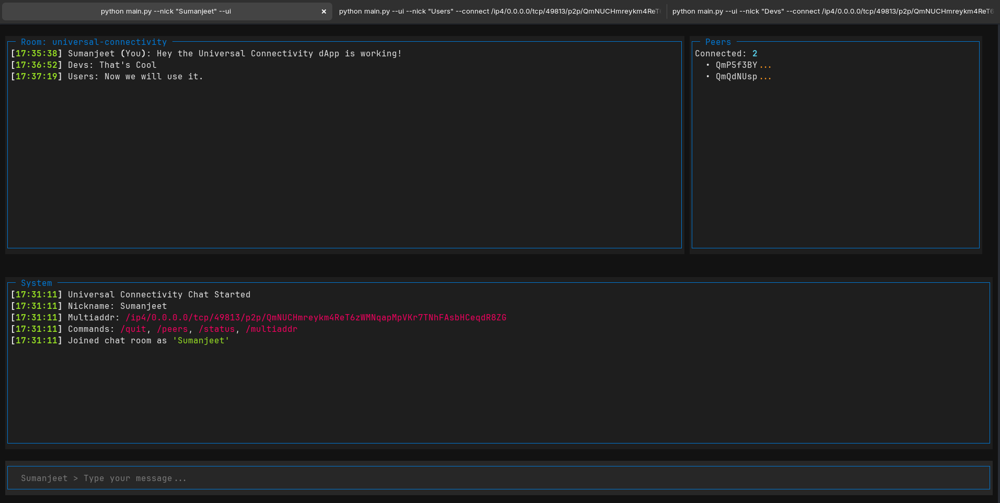

# py-peer 🌐

A Python implementation of the Universal Connectivity peer-to-peer chat application using libp2p networking.

This is the Python implementation of the [Universal Connectivity][UNIV_CONN] app showcasing the [Gossipsub][GOSSIPSUB] features of the core libp2p protocol as found in the [py-libp2p][PYLIBP2P] Python libp2p implementation. The implementation currently uses TCP.

## 📋 Table of Contents

- [Overview](#overview)
- [Features](#features)
- [Architecture](#architecture)
- [Prerequisites](#prerequisites)
- [Installation](#installation)
- [Usage](#usage)
- [Configuration](#configuration)
- [Development](#development)
- [Troubleshooting](#troubleshooting)
- [Contributing](#contributing)

## 🚀 Overview

py-peer is a decentralized chat application that enables peer-to-peer communication without requiring central servers. Built on libp2p, it provides secure, direct communication between participants using modern networking protocols.

## 📸 Screenshots

### Textual TUI Interface


*The Textual Terminal User Interface showing a live chat session with multiple connected peers. The interface features a main chat area, connected peers panel, system messages, and input field.*

### Key Technologies

- **[libp2p](https://libp2p.io/)** - Modular peer-to-peer networking stack
- **[Trio](https://trio.readthedocs.io/)** - Async/await framework for Python
- **[Textual](https://textual.textualize.io/)** - Modern Terminal User Interface framework
- **[GossipSub](https://docs.libp2p.io/concepts/pubsub/overview/)** - Pub/sub messaging protocol

## ✨ Features

- **Peer-to-Peer Chat** - Direct communication without central servers
- **Multiple UI Modes** - Textual TUI, headless mode, or simple interactive mode
- **Real-time Messaging** - Instant message delivery through GossipSub
- **Peer Discovery** - Automatic discovery of other peers in the network
- **Cross-Platform** - Works on Linux, macOS, and Windows
- **Secure Communication** - Built-in encryption and peer authentication
- **System Logging** - Structured logging of system events

## 🏗️ Architecture

```
┌─────────────────┐    ┌─────────────────┐    ┌─────────────────┐
│   UI Layer      │    │   Headless      │    │   Chat Room     │
│                 │    │   Service       │    │                 │
│ • Textual TUI   │◄──►│ • Message Queue │◄──►│ • libp2p Host   │
│ • Interactive   │    │ • Event Loop    │    │ • PubSub        │
│ • Commands      │    │ • State Mgmt    │    │ • GossipSub     │
└─────────────────┘    └─────────────────┘    └─────────────────┘
                                ▲
                                │
                         ┌─────────────────┐
                         │   P2P Network   │
                         │                 │
                         │ • Peer Discovery│
                         │ • Message Relay │
                         │ • Topic Subscr. │
                         └─────────────────┘
```

### Components

- **main.py** - Application entry point and argument parsing
- **ui.py** - Textual-based terminal user interface
- **headless.py** - Background service managing libp2p operations
- **chatroom.py** - Chat room logic and message handling

## 📋 Prerequisites

- **Python 3.12+**
- **uv** (recommended) or pip package manager
- Network connectivity for peer-to-peer communication

## 🛠️ Installation

### Option 1: Using uv (Recommended)

```bash
# Clone the repository
git clone https://github.com/sumanjeet0012/universal-connectivity.git
cd universal-connectivity

# Switch to the py-peer development branch
git checkout py-peer-development
cd py-peer

# Create virtual environment
uv venv

# Activate virtual environment
source .venv/bin/activate  # Linux/macOS
# or
.venv\Scripts\activate     # Windows

# Install the package
uv pip install -e .
```

### Option 2: Using pip

```bash
# Clone the repository
git clone https://github.com/sumanjeet0012/universal-connectivity.git
cd universal-connectivity

# Switch to the py-peer development branch
git checkout py-peer-development
cd py-peer

# Create virtual environment
python -m venv .venv

# Activate virtual environment
source .venv/bin/activate  # Linux/macOS
# or
.venv\Scripts\activate     # Windows

# Install the package
pip install -e .
```

## 🎯 Usage

### Basic Usage

```bash
# Start in CLI mode (simple interactive mode)
py-peer --nick YourName

# Start with Textual TUI
py-peer --nick Alice --ui

# Start in headless mode (no UI)
py-peer --nick Bob --headless

# Connect to a specific peer
py-peer --nick Charlie --connect /ip4/127.0.0.1/tcp/PORT/p2p/PEER_ID
```

### Command Line Options

| Option | Description | Example |
|--------|-------------|---------|
| `--nick NAME` | Set your nickname | `--nick Alice` |
| `--ui` | Use Textual TUI interface | `--ui` |
| `--headless` | Run without UI (terminal output only) | `--headless` |
| `--connect ADDR` | Connect to specific peer | `--connect /ip4/...` |
| `--port PORT` | Set listening port | `--port 8080` |
| `--verbose` | Enable debug logging | `--verbose` |

### In-Chat Commands

| Command | Description |
|---------|-------------|
| `/quit` | Exit the chat |
| `/peers` | Show connected peers |
| `/status` | Display connection status |
| `/multiaddr` | Show your multiaddress for sharing |

## ⚙️ Configuration

### Environment Variables

- `UV_LINK_MODE=copy` - Use copy mode for uv installations (if needed)

### Log Files

- **`system_messages.txt`** - System events and connection logs
  - Format: `[HH:MM:SS] message`
  - Contains: startup, peer connections, errors

### Network Configuration

The application automatically:
- Generates a unique peer ID
- Listens on a random available port
- Subscribes to standard Universal Connectivity topics

## 🔧 Development

### Project Structure

```
py-peer/
├── main.py              # Entry point
├── ui.py                # Textual TUI implementation
├── headless.py          # Background service
├── chatroom.py          # Chat room logic
├── pyproject.toml       # Project configuration
├── uv.lock             # Dependency lock file
├── system_messages.txt  # System logs
└── README.md           # This file
```

### Running from Source

```bash
# Development mode
python main.py --nick TestUser --verbose

# Run with specific Python version
python3.12 main.py --nick TestUser
```

### Code Style

The project follows Python best practices:
- Type hints where applicable
- Async/await patterns
- Modular architecture
- Comprehensive logging

## 🐛 Troubleshooting

### Common Issues

**1. Port Already in Use**
```bash
# Solution: Specify a different port
py-peer --nick YourName --port 8081
```

**2. No Peers Found**
- Ensure other peers are running on the same network
- Check firewall settings
- Use `--connect` to manually connect to known peers

**3. Permission Denied on Log File**
```bash
# Solution: Check file permissions
chmod 644 system_messages.txt
```

### Debug Mode

Enable verbose logging to diagnose issues:
```bash
py-peer --nick DebugUser --verbose
```

### Network Testing

Test peer connectivity:
```bash
# Terminal 1
py-peer --nick Peer1 --port 8080

# Terminal 2 (connect to Peer1)
py-peer --nick Peer2 --connect /ip4/127.0.0.1/tcp/8080/p2p/PEER_ID_FROM_PEER1
```

## 🤝 Contributing

1. Fork the repository
2. Create a feature branch
3. Make your changes
4. Test thoroughly
5. Submit a pull request

## 🙏 Acknowledgments

- [libp2p](https://libp2p.io/) - Peer-to-peer networking framework
- [Trio](https://trio.readthedocs.io/) - Async framework
- [Textual](https://textual.textualize.io/) - Terminal UI framework

---

## 📞 Support

For support and questions:
- Create an issue in the repository
- Check the troubleshooting section above
- Review the system logs in `system_messages.txt`

**Happy chatting! 🎉**

[GOSSIPSUB]: https://github.com/libp2p/specs/blob/master/pubsub/gossipsub/README.md
[PYLIBP2P]: https://github.com/libp2p/py-libp2p
[QUIC]: https://github.com/libp2p/specs/blob/master/quic/README.md
[UNIV_CONN]: https://github.com/libp2p/universal-connectivity
